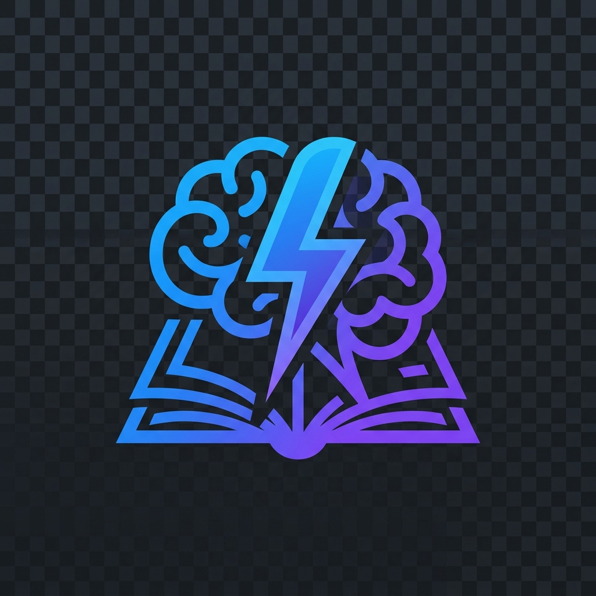

<p align="center">
  
</p>

<h1 align="center">RealSTEM v9.9</h1>

<p align="center">
  <b>Turn breaking news into STEM lessons students actually care about.</b>
</p>

<p align="center">
  
  
  
  
</p>

---

> **⚠️ This project is actively under development.**  
> Core features are functional but some modules are being refined. Contributions & feedback welcome!

---

## 💡 What is RealSTEM?

Students ask *"When will I ever use this?"* every day. Teachers spend hours hunting for real-world examples. **RealSTEM fixes both.**

It's an AI-powered platform that:
1. Takes any **current news headline**
2. Runs it through our **STEM relevance engine**
3. Outputs a **standards-aligned lesson plan** — ready for teacher review

```
📰 News Headline  →  🧠 AI Engine  →  📋 Lesson Draft  →  👩‍🏫 Teacher Review
```

---

## ⚡ Quick Start

```bash
npm install
npm run dev
# → http://localhost:3000
```

---

## 🗂 Project Structure

```
Real_Stem/
│
├── public/                      ← Frontend (Pure HTML/CSS/JS)
│   ├── index.html               # Splash + Landing Page
│   ├── auth.html                # Login / Register
│   ├── dashboard.html           # AI Lesson Generator
│   ├── css/styles.css           # Design System (Dark Glassmorphism)
│   ├── js/app.js                # Landing page interactivity
│   ├── js/auth.js               # Auth flow logic
│   ├── js/dashboard.js          # Generator + API integration
│   └── assets/logo.png          # Brand logo
│
├── src/                         ← Backend (Next.js API)
│   ├── app/api/generate-lesson/ # POST endpoint
│   └── lib/lesson-generator.ts  # Core AI lesson engine
│
└── package.json
```

---

## 🎨 Features

| Feature | Status |
|---------|--------|
| Cinematic splash screen | ✅ Done |
| Premium SaaS landing page | ✅ Done |
| User auth UI (Login/Register) | ✅ Done |
| AI lesson generation API | ✅ Done |
| Dashboard with live generation | ✅ Done |
| 6 STEM subjects supported | ✅ Done |
| Multi-locale (India/US/Global) | ✅ Done |
| Responsive mobile layout | ✅ Done |
| News feed auto-ingestion | 🚧 WIP |
| Saved lessons & history | 🚧 WIP |
| Teacher analytics dashboard | 📋 Planned |
| Student-facing lesson view | 📋 Planned |

---

## 🛠 Stack

```
Frontend  →  HTML5 · CSS3 · Vanilla JS
Design    →  Custom Design Tokens · Glassmorphism · CSS Animations
Backend   →  Next.js API Routes · TypeScript
Fonts     →  Inter · Space Grotesk · JetBrains Mono
```

---

## 🔄 How It Works

```
┌─────────────────┐     ┌──────────────────┐     ┌─────────────────┐     ┌────────────────┐
│  📡 News Input   │ ──▶ │  🎯 STEM Scoring  │ ──▶ │  🧠 AI Drafting  │ ──▶ │  👩‍🏫 Review    │
│  (Any headline)  │     │  (Subject match)  │     │  (Full lesson)   │     │  (Edit & save) │
└─────────────────┘     └──────────────────┘     └─────────────────┘     └────────────────┘
```

---

## 📸 Screenshots

> *Coming soon — UI polish in progress*

---

<p align="center">
  <sub>Built with 🧠 for the future of STEM education</sub>
</p>
